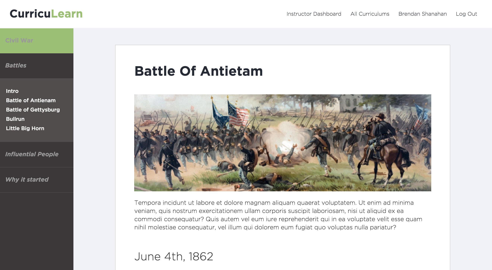

# Curriculearn

This README Last Updated: 2015/11/04

CurricuLearn - Learning platform for homeschool parents and students

Deployed on AWS at [curriculearn.xyz](www.curriculearn.xyz) 





## Overview

Built with Ruby on Rails and Angular.js. See Gemfile for all of the Gems used. Created by [Lan](https://github.com/lannng), [Sourabh](https://github.com/sourabhpal), [Nick](https://github.com/nleonard0112), and [Isaac](https://github.com/ilee).


## How to run locally:

Requires [Ruby on Rails](http://rubyonrails.org/) installed

- Clone this repo to a local directory

```
bundle install
```

```
bundle update
```

```
rake db:seed
```

```
rails s
```